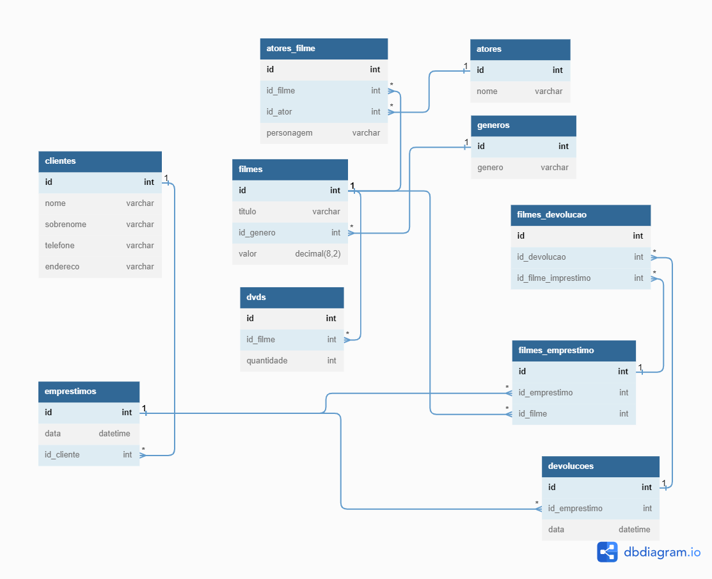

# Locadora 🎞️ PostgreSQL 🛢️
Controle de estoque e aluguel de CD-DVD

#

#### Desafio 🎯

Uma pequena locadora de vídeos possui ao redor de 2000 DVDs, cujo empréstimo deve ser controlado. Cada DVD
possui um número de identificação e contém um único filme. Cada filme recebe um identificador próprio, e sabe-se
título e categoria (comédia, drama, aventura, …).
Para cada filme cadastrado há pelo menos um DVD. Além disso, filmes mais longos necessitam de dois DVDs. Os
clientes podem desejar encontrar os filmes estrelados pelo seu ator predileto. Por isso, é necessário manter a informação
dos atores que estrelam em cada filme, mas nem todo filme possui estrelas.
Muitos clientes, quando vêem a listagem de atores do filme escolhido, ficam interessados em saber, para um
determinado ator, o seu nome real e de quais outros filmes do mesmo gênero aquele ator participou. A locadora possui
muitos clientes cadastrados, dos quais sabe-se nome, sobrenome, telefone e endereço de contato. Além disso, cada
cliente recebe um número de associado.
Finalmente o sistema deve permitir a consulta a empréstimos de DVDs, com informações de qual cliente alugou o quê,
datas de empréstimo e devolução, valor pago ou a pagar, atrasos, etc.

#

Skills🧠

* SQL
    * Create - DDL
    * Insert - DML
    * Select - DML
    * Update - DML
    * Delete - DML
#

### Stack 📚

> ### PostgreSQL 🐘

##### Site de diagrama:

> ### [dbdiagram](https://dbdiagram.io/)

#

<h4>Diagrama 📉</h4>

